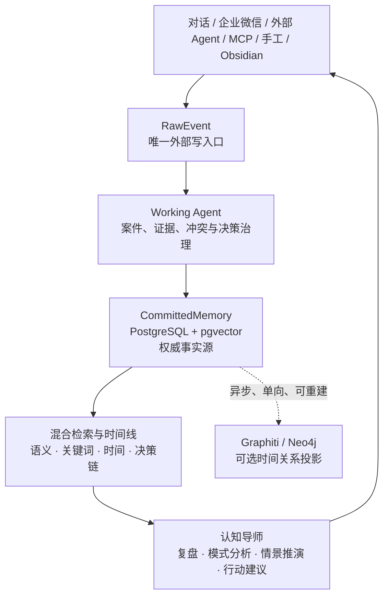

# Aion Memory Nexus · 永识中枢

> Predictive AI Agent Memory & Second Brain — a trusted life mentor built from evidence, not a passive archive.
>
> 面向个人与小团队的预测型第二大脑：把对话、Agent、企业微信、文件和链接沉淀为可追溯的认知证据，再将记忆用于模式分析、决策复盘、情景推演和行动引导。

[](LICENSE)
[](https://www.python.org/)
[](https://github.com/234194027-cpu/aion-memory-nexus/actions/workflows/quality.yml)

**当前版本：2.5.4 · 许可证：[MIT](LICENSE) · 开源状态：Public**

## 不只是记忆库：你的可信第二大脑

多数“记忆”方案停在保存和搜索：把模型提取出的文本直接当作长期事实。这在真实生活、跨 Agent 协作和持续对话中不够，也很危险：来源会丢失，过期内容会被误用，冲突无法说明，外部 Agent 还可能污染正式记忆。

Aion Memory Nexus 的目标不是替你“记住更多”，而是帮你**看见自己的决策模式、复盘结果、比较选择，并在下一次关键选择前提供有来源的分析**。记忆是输入，预测分析与人生决策支持才是最终闭环。

它把**事件、证据、决策和正式记忆分开**：原始内容可追溯，正式记忆可修正或撤回，外部 Agent 只能提供事件，不能直接写入正式记忆。基于这条可信主干，系统再组织历史决策、人格假设、时间线和相似案例，为“人生导师”式的建议提供证据基础。

> **人始终是最终决策者。** 系统输出的是带证据、置信度、局限和替代方案的分析或情景推演，不是确定性预言，也不替用户作出高风险决定。

## 核心能力

| 能力 | 当前实现 |
| --- | --- |
| 可信记忆主干 | `RawEvent → MemoryWorkCase → Evidence → Decision → CommittedMemory`，带来源、版本、生命周期与审计链路。 |
| 对话与企业微信 | 统一 Conversation Ledger；支持自然聊天、撤回、修正、不要记和受限主动跟进。 |
| Agent / MCP | 外部 Agent 在最小权限范围内读取上下文、追加 RawEvent、导入增量；正式记忆只由内置 Working Agent 治理。 |
| 混合检索 | PostgreSQL/pgvector、关键词、时间与上下文分层；检索结果包含来源与可见范围。 |
| 第二大脑与人生导师 | 汇集决策历史、人格假设、任务和时间线，支持决策复盘、模式识别、方案比较与行动建议。 |
| 预测与情景分析 | 以历史证据、相似决策和当前约束生成可解释的情景推演；输出置信度与不确定性，而非伪装成确定事实。 |
| 媒体与链接 | URL、文件、图片、表格、音频、视频先作为来源工件，再进入治理链路。 |
| Graphiti / Neo4j（可选） | 仅作为可删除、可重建的 Shadow 时间关系投影；不改变正式召回结果，也不能反写权威记忆。 |
| 运维与可观测性 | Docker Compose、健康检查、指标、迁移、生产预检和受控运行时开关。 |

## 架构一览



### 不是什么

- 不是把所有聊天内容永久保存的“日志仓库”。
- 不是只有搜索功能的向量数据库包装器；记忆必须回到分析、预测和决策支持闭环。
- 不是允许外部 Agent 直接写正式记忆的共享数据库。
- 不是多租户 SaaS；当前默认按单用户/自托管边界设计。
- 不是 Graphiti 的外部代理；Graphiti 仅为内部可选投影。
- 不是替用户承担人生、医疗、法律、财务或其他高风险决定的自动决策器。

## 快速开始

### 1. 准备本地开发环境

推荐 **Python 3.11**。Windows 上请使用 Python 3.11 或 Docker；Python 3.14 不是当前稳定测试运行时。

```bash
git clone https://github.com/234194027-cpu/aion-memory-nexus.git
cd aion-memory-nexus
python -m venv .venv
```

Windows PowerShell：

```powershell
.\.venv\Scripts\Activate.ps1
pip install -r requirements.txt
Copy-Item .env.example .env
```

macOS / Linux：

```bash
source .venv/bin/activate
pip install -r requirements.txt
cp .env.example .env
```

本地开发可在 `.env` 覆盖为 SQLite，并设置自己的非占位密钥：

```env
ENVIRONMENT=development
POSTGRES_URL=sqlite+aiosqlite:///./life_memory.db
SECRET_KEY=replace-with-a-random-local-development-secret-at-least-32-characters
ENABLE_SCHEDULER=false
BOOTSTRAP_DEFAULTS=true
CREATE_SCHEMA_ON_STARTUP=true
SOLO_MODE=true
```

启动 API：

```bash
python -m uvicorn src.main:app --host 127.0.0.1 --port 8000
```

打开：

- Health：<http://127.0.0.1:8000/health>
- OpenAPI（非生产）：<http://127.0.0.1:8000/docs>

### 2. Docker Compose 部署

Compose 运行 PostgreSQL/pgvector、Redis、API、Worker、Nginx，生产配置必须通过环境变量提供密码、Token 与证书。**绝不提交 `.env`、证书、数据库或生产导出。**

```bash
cp .env.example .env
# 编辑 .env：至少替换 POSTGRES_PASSWORD、REDIS_PASSWORD、SECRET_KEY、SYSTEM_API_TOKEN
# 准备 certs/life-memory.crt 与 certs/life-memory.key
docker compose up -d --build
```

启动前建议运行只读预检：

```bash
python scripts/production_preflight.py --env-file .env --compose-file docker-compose.yml --cert-dir certs --public-url https://your-domain.example
```

Graphiti/Neo4j 保持默认关闭。V2.5.1 即使启用也只运行 Shadow 对比，不参与 Agent 上下文和正式召回排序；未来提升权限必须经过新的架构版本与独立验收。

## Agent 与 MCP

外部 Agent 的顺序很简单：**开工前读取、工作中检索、结束后追加 RawEvent**。

1. 连接后先调用 `memory_map`、`memory_list_types`、`memory_policy_status`。
2. 非简单任务开始前调用 `memory_before_start`。
3. 任务过程中按需调用 `memory_search`。
4. 结束后只用 `memory_after_end` 或 `memory_upload_event` 写入事件。

外部 Agent 不得创建、修改、撤回或删除 `CommittedMemory`，也不得访问 Graphiti 写入、回放或管理接口。详细协议见：

- [MCP 主 Skill](skills/life-memory-mcp-connect/SKILL.md)
- [媒体接入 Skill](skills/life-memory-media-ingestion/SKILL.md)
- [MCP 访问地图](skills/life-memory-mcp-connect/references/memory-access-map.md)

版本化 Skill 发布物由 `scripts/build_skill_release.py` 生成到 `static/skills/`。线上 HTTPS 分发是否可用取决于部署实例；下载前必须读取 manifest 并校验 SHA256，不能把 SPA HTML 当作 ZIP 安装。

## 验证与质量门

```bash
# 快速导入
python -X utf8 -c "import src.app.main; print('IMPORT_OK')"

# 迁移往返
python -X utf8 scripts/check_migrations.py

# 单元测试
python -X utf8 -m pytest tests/unit -q

# 前端检查
cd admin-web
npm ci
npm run lint
npm run typecheck
npm run build
```

GitHub Actions 在 Python 3.12 与 Node 22 上执行静态检查、测试、迁移往返和前端构建。涉及真实企业微信、模型凭证、TLS 和生产数据的验收刻意不放进公开 CI。

## 安全与数据边界

- 权威数据在 PostgreSQL/pgvector；Neo4j/Graphiti 是可丢弃的派生投影。
- API Key、Agent Token、模型凭证和媒体原文不得写入日志、指标、Issue 或 Pull Request。
- 部署前请阅读 [安全披露政策](SECURITY.md)、[运行手册](docs/operational-runbook.md) 和 [数据生命周期说明](docs/data-lifecycle-runbook.md)。
- 发现安全问题请不要公开贴出复现凭证；请按 [SECURITY.md](SECURITY.md) 的私密渠道报告。

## 文档导航

- [认知架构与产品定位](docs/cognitive-architecture.md)：当前系统边界、可信记忆主干，以及记忆如何服务于分析、预测和人生决策支持。
- [可信记忆中枢 V3 / Graphiti 运行手册](docs/graphiti-v3-runbook.md)
- [运行可观测性与失败处理](docs/operational-runbook.md)
- [第三方归属与许可证](docs/licenses/third-party-attributions.md)
- [贡献指南](CONTRIBUTING.md)

## 贡献

欢迎 Bug 修复、测试补充、文档改进和经过讨论的功能贡献。请先阅读 [CONTRIBUTING.md](CONTRIBUTING.md)，尤其注意：不提交真实凭证、不绕过 RawEvent 治理边界、不把静态检查称为真实外部验收。

## 许可证与致谢

本项目以 [MIT License](LICENSE) 开源。第三方设计参考、许可证与独立实现边界见 [NOTICE](NOTICE) 和 [第三方归属清单](docs/licenses/third-party-attributions.md)。
