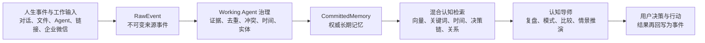

# Aion Memory Nexus · 认知架构与产品定位

## 一句话定位

**Aion Memory Nexus（永识中枢）是一个以可信长期记忆为基础的预测型第二大脑与人生导师。**

它不把“存下来的内容更多”当作终点。每条记忆最终应帮助用户在未来的时刻：理解过去、识别模式、复盘决策、比较方案、评估风险，并选择下一步行动。

## 从记忆到决策支持

这是一个闭环，而不是单向资料库：行动结果会成为新的事件与证据，使下一次分析能够校正之前的假设。

## 系统为什么与普通记忆产品不同

| 常见方案 | Aion Memory Nexus |
| --- | --- |
| 直接把对话摘要写成“事实” | `RawEvent → Evidence → Decision → CommittedMemory`；每条正式记忆均可回溯、修正、撤回或过期。 |
| 只做向量相似度搜索 | 融合语义、关键词、时间、记忆生命周期、决策历史和可选图关系，重建“当时为什么这样想”。 |
| Agent 可任意写入长期记忆 | 外部 Agent 只能追加事件；内置 Working Agent 在证据与权限治理下处理正式记忆。 |
| 旧结论覆盖新结论 | 保留版本、有效期、冲突与修正关系，区分“当时成立”和“当前仍成立”。 |
| 记住内容即完成 | 将可信记忆送入复盘、模式识别、风险比较和情景推演，形成可追溯的决策支持。 |

## 第二大脑与人生导师能力

系统将长期记忆视为用户认知轨迹的一部分，而非静态文件：

- **决策复盘**：找回选择、当时理由、约束、结果和后续修正。
- **模式识别**：从跨时间的偏好、原则、任务、项目和结果中识别重复模式与潜在矛盾。
- **方案比较**：将当前问题与相似历史决策、可用资源和风险信号放在同一上下文中比较。
- **情景推演**：结合明确的假设、历史证据和不确定性，生成可能路径、风险点与待验证问题。
- **行动引导**：将建议落到下一步问题、验证动作、任务或复盘节点，而不是只给抽象结论。

“人生导师”不是替用户定义人生或替用户下决定，而是持续提供忠于证据、尊重用户边界的镜子与参谋。

## 预测分析的可信边界

预测在这里指**基于已治理证据的情景分析**，不是承诺结果或制造确定性幻觉。任何预测性输出都应：

1. 指明关联的来源、历史决策或有效记忆；
2. 区分事实、推断、假设与待验证项；
3. 给出置信度、不确定性和反例；
4. 对医疗、法律、财务、人身安全等高风险场景提示寻求合格专业人士；
5. 保证用户拥有最终选择、修正与删除的权利。

## 权威数据与派生投影

- **权威源**：PostgreSQL/pgvector 中的 `RawEvent`、`MemoryWorkCase`、`MemoryWorkEvidence`、`MemoryWorkDecision` 与 `CommittedMemory`。
- **检索层**：向量、关键词、时间和权限过滤共同决定可进入上下文的证据。
- **图谱层**：Graphiti/Neo4j 是可选、可删除、可重建的时间关系投影；它不反写权威记忆，也不能独自触发记忆正式化。
- **权限层**：每次读取与写入受用户、项目、可见范围和敏感级别约束。

## 当前能力与演进原则

当前仓库已提供可信事件主干、Working Agent 治理、混合检索、决策与人格相关的认知服务，以及可选的时间图谱投影。系统对“预测”和“人生导师”的承诺，建立在可追溯证据、明确假设和人工最终决策之上。

后续演进优先提高证据质量、时间关系、结果回填和分析可解释性，而不是扩大无证据的自动化决策权。
